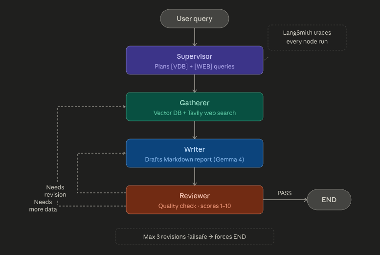
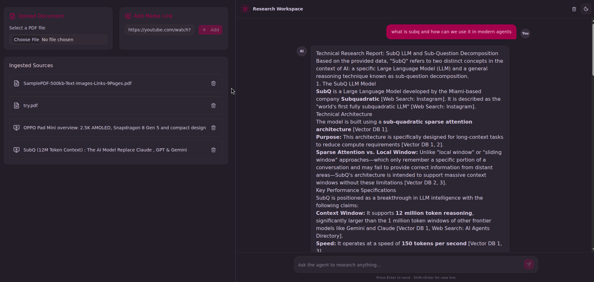
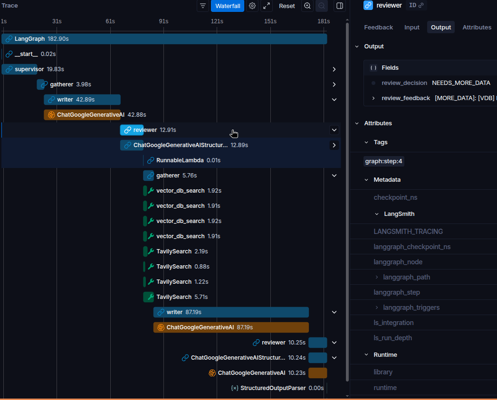

# 🔬 Research Agent

A multi-agent AI research assistant built with **LangGraph**, **Next.js**, and **Gemini AI Studio** free-tier models. Upload PDFs or YouTube videos as knowledge sources, then ask complex research questions — the agent plans, gathers, writes, and self-reviews a complete Markdown report.

**Live demo:** [research-agent-five-beta.vercel.app](https://research-agent-five-beta.vercel.app/)

---

## Architecture Overview

The system is a four-node LangGraph state machine where agents collaborate in a loop until the reviewer is satisfied or the revision limit is hit.

```
START → Supervisor → Gatherer → Writer → Reviewer ──PASS──→ END
                         ↑           ↑         │
                         │           └─────────┘ NEEDS_REVISION
                         └───────────────────── NEEDS_MORE_DATA
                                  (max 3 revisions failsafe)
```

### Agent Roles

| Agent | Model | Responsibility |
|---|---|---|
| **Supervisor** | `gemini-3.1-flash-lite` (structured output) | Decomposes the user query into `[VDB]` and `[WEB]` tagged search queries |
| **Gatherer** | — (tool executor) | Runs vector DB semantic search + Tavily web search in parallel |
| **Writer** | `gemma-4-31b-it` | Drafts a structured Markdown report strictly from gathered data; cites sources inline |
| **Reviewer** | `gemini-3.1-flash-lite` (structured output) | Scores the report 1–10 and issues `PASS`, `NEEDS_REVISION`, or `NEEDS_MORE_DATA` |

### Conditional Routing (Reviewer → ?)

```
review_decision = PASS           → END          (stream final report to client)
review_decision = NEEDS_REVISION → writer       (re-draft with feedback)
review_decision = NEEDS_MORE_DATA→ gatherer     (re-gather with new [VDB]/[WEB] queries)
revision_count  ≥ 3             → END (forced)  (failsafe — prevents infinite LLM cost loops)
```

---

## Screenshots & Traces

### Agent Graph
The four-node LangGraph state machine — supervisor plans, gatherer fetches, writer drafts, reviewer routes back or passes.



---

### Chat Interface
Real-time node status indicators stream as the graph executes — users see exactly which agent is active before the final report arrives.



---

### LangSmith Trace
Full waterfall view of a multi-revision run. Each node is a child span with token counts, latency, and exact prompt/output.



[**View live trace →**](https://smith.langchain.com/public/97516bf6-0c88-4eba-8797-e980f9638cfd/r)

## Agent Flow Diagram

```
┌──────────────┐
│  User Query  │
└──────┬───────┘
       │
       ▼
┌──────────────────────────────────────┐
│  SUPERVISOR  (gemini-flash-lite)     │
│  Outputs structured research plan:  │
│  [VDB] query1  [WEB] query2 ...      │
└──────────────────┬───────────────────┘
                   │
                   ▼
┌──────────────────────────────────────┐
│  GATHERER  (parallel execution)      │
│  ├─ vectorDbSearchTool  → Supabase   │
│  └─ webSearchTool       → Tavily     │
└──────────────────┬───────────────────┘
                   │  gathered_data[]
                   ▼
┌──────────────────────────────────────┐
│  WRITER  (gemma-4-31b)               │
│  Strict: data-only, no hallucination │
│  Output: Markdown report + citations │
└──────────────────┬───────────────────┘
                   │  draft_report
                   ▼
┌──────────────────────────────────────┐
│  REVIEWER  (gemini-flash-lite)       │
│  Scores: factual grounding,          │
│  completeness, citations, structure  │
└──────┬───────────┬────────────┬──────┘
       │           │            │
     PASS     NEEDS_REVISION  NEEDS_MORE_DATA
       │           │            │
      END       Writer       Gatherer
```

---

## Document Ingestion Pipeline

```
PDF Upload ──→ LlamaCloud (markdown parse) ──┐
                                              ├──→ BGE-M3 embedding (1024d) ──→ Supabase pgvector
YouTube URL → Supadata (transcript) ─────────┘
```

### PDF Ingestion
1. File uploaded to **Supabase Storage**
2. Parsed to Markdown via **LlamaCloud** (cost-effective tier)
3. Split into 1200-char chunks with 250-char overlap using `RecursiveCharacterTextSplitter`
4. Each chunk embedded with `BAAI/bge-m3` via HuggingFace Inference API
5. Stored in **Supabase** via Prisma `$executeRaw` with `::vector(1024)` cast

### YouTube Ingestion
1. Transcript fetched via **Supadata** (with async job polling for long videos)
2. Grouped into ~90-second windows then chunked
3. Metadata preserved: `timestamp`, `timestampUrl` (deep-link to the exact second)
4. Embedded and stored identically to PDF chunks

### Semantic Search
Supabase RPC (`match_document_chunks`) with:
- `match_threshold: 0.5`
- `match_count: 3`
- Optional `filter_document_id` for source-scoped queries

---

## Tech Stack

| Layer | Technology |
|---|---|
| **Framework** | Next.js 16 (App Router) |
| **Agent orchestration** | LangGraph (`@langchain/langgraph`) |
| **LLM provider** | Google AI Studio — Gemini 3.1 Flash Lite + Gemma 4 31B |
| **Streaming** | Vercel AI SDK (`ai`, `@ai-sdk/react`) |
| **Web search** | Tavily (`@langchain/tavily`) |
| **PDF parsing** | LlamaCloud (`@llamaindex/llama-cloud`) |
| **YouTube transcripts** | Supadata (`@supadata/js`) |
| **Embeddings** | HuggingFace Inference — `BAAI/bge-m3` (1024d) |
| **Vector DB** | Supabase + pgvector |
| **ORM** | Prisma with `@prisma/adapter-pg` |
| **State management** | Zustand |
| **UI** | Tailwind CSS v4, shadcn/ui, Radix UI |
| **Observability** | LangSmith (tracing) |
| **Deployment** | Vercel |

---

## LangSmith Tracing

LangSmith traces every node execution automatically. To enable, set these in `.env`:

```bash
LANGSMITH_TRACING=true
LANGSMITH_ENDPOINT="https://api.smith.langchain.com"
LANGSMITH_API_KEY="your-key"
LANGSMITH_PROJECT="research-agent"
```

Each request produces a single LangSmith trace with child spans per node (`supervisor → gatherer → writer → reviewer → ...`). You can inspect token counts, latencies, and the exact prompts/outputs at every revision step — useful for debugging why the reviewer keeps rejecting a draft.

> **Tip:** Add `LANGSMITH_PROJECT` per-environment (e.g. `research-agent-prod` vs `research-agent-dev`) so traces from Vercel deployments don't mix with local runs.

---

## LangGraph State Schema

```typescript
GraphAnnotation = {
  messages:        BaseMessage[]   // append-only (messagesStateReducer)
  research_plan:   string[]        // replaced each supervisor run
  gathered_data:   string[]        // appended across gatherer runs
  draft_report:    string          // replaced each writer run
  review_feedback: string          // replaced each reviewer run
  review_decision: ReviewDecision  // "PASS" | "NEEDS_REVISION" | "NEEDS_MORE_DATA"
  revision_count:  number          // incremented (+1) each writer run
}
```

The `gathered_data` reducer appends rather than replaces — so if the reviewer requests more data, the re-gather results stack on top of what was already collected.

---

## Project Structure

```
├── app/
│   ├── api/chat/route.ts        # LangGraph stream → AI SDK UIMessageStream
│   ├── actions/
│   │   ├── ingest.ts            # PDF upload + chunk + embed server action
│   │   ├── youtube-ingest.ts    # YouTube transcript server action
│   │   └── sources.ts           # fetch / delete sources
│   └── page.tsx
├── lib/
│   ├── langgraph/
│   │   ├── graph.ts             # StateGraph definition + conditional edges
│   │   ├── state.ts             # GraphAnnotation + reducers
│   │   ├── tools.ts             # vectorDbSearchTool + webSearchTool
│   │   └── node/
│   │       ├── supervisor.ts
│   │       ├── gatherer.ts
│   │       ├── writer.ts
│   │       └── reviewer.ts
│   ├── parser.ts                # PDF → LlamaCloud → chunks
│   ├── youtube-parser.ts        # YouTube → Supadata → chunks
│   ├── embeddings.ts            # BGE-M3 via HuggingFace
│   ├── semanticSearch.ts        # Supabase RPC wrapper
│   ├── prisma.ts                # Prisma singleton (PrismaPg adapter)
│   └── supabase.ts              # Supabase client
├── components/
│   ├── chat2.tsx                # Streaming chat UI with node status indicators
│   ├── sources.tsx              # PDF/YouTube ingestion UI
│   └── mainLayout.tsx           # Responsive split-panel layout
└── prisma/schema.prisma         # Document + DocumentChunk models (pgvector)
```

---

## Getting Started

### Prerequisites

- Node.js 18+
- A Supabase project with `pgvector` extension enabled
- API keys for: Google AI Studio, HuggingFace, Tavily, LlamaCloud, Supadata, LangSmith

### 1. Clone & install

```bash
git clone <your-repo-url>
cd research-agent
npm install
```

### 2. Configure environment

Copy `.env.example` to `.env` and fill in all keys:

```bash
cp .env.example .env
```

```bash
# Google AI Studio (Gemini + Gemma)
GOOGLE_API_KEY=""

# Supabase
DATABASE_URL=""           # pooled (Prisma runtime)
DIRECT_URL=""             # direct (migrations)
NEXT_PUBLIC_SUPABASE_DATA_API=""
SERVICE_ROLE_KEY=""

# AI Services
HUGGINGFACE_API_KEY=""
LLAMA_CLOUD_API_KEY=""
TAVILY_API_KEY=""
SUPADATA_API_KEY=""

# LangSmith observability
LANGSMITH_TRACING=true
LANGSMITH_ENDPOINT="https://api.smith.langchain.com"
LANGSMITH_API_KEY=""
LANGSMITH_PROJECT=""
```

### 3. Set up the database

Run Prisma migrations — this creates the `Document` and `DocumentChunk` tables and enables pgvector:

```bash
npx prisma migrate dev
```

Then create the semantic search RPC in your Supabase SQL editor:

```sql
create or replace function match_document_chunks (
  query_embedding vector(1024),
  match_threshold float,
  match_count int,
  filter_document_id uuid default null
)
returns table (
  id uuid,
  document_id uuid,
  content text,
  metadata jsonb,
  similarity float
)
language plpgsql
as $$
begin
  return query
  select
    dc.id,
    dc."documentId",
    dc.content,
    dc.metadata,
    1 - (dc.embedding <=> query_embedding) as similarity
  from "DocumentChunk" dc
  where (filter_document_id is null or dc."documentId" = filter_document_id)
    and 1 - (dc.embedding <=> query_embedding) > match_threshold
  order by similarity desc
  limit match_count;
end;
$$;
```

### 4. Run locally

```bash
npm run dev
```

Open [http://localhost:3000](http://localhost:3000).

---

## Deployment (Vercel)

This project is deployed on Vercel. Key settings:

- **Framework preset:** Next.js
- **Build command:** `npm run build` (runs `prisma generate` via postinstall)
- **Environment variables:** Copy all `.env` keys into the Vercel dashboard
- **Function timeout:** The `api/chat` route has `export const maxDuration = 300` (requires a Vercel Pro plan for >60s)

> **Note on free-tier models:** Both `gemini-3.1-flash-lite-preview` and `gemma-4-31b-it` are used via Google AI Studio free tier. Under heavy load or rate limits, the graph will surface LangChain errors in the stream. Consider adding retry logic or upgrading to Vertex AI for production.

---

## Key Design Decisions

**Why LangGraph instead of a simple chain?**
The review loop requires true conditional branching — the graph can route back to the gatherer (not just the writer) when data is genuinely missing. A linear chain can't express this without bespoke state management.

**Why Gemma 4 for writing?**
Gemma 4's 31B parameter scale produces measurably better long-form structured text than the flash-lite model. The supervisor and reviewer tasks are structured-output extraction — they don't need raw generation power, so flash-lite keeps costs minimal.

**Why BGE-M3 for embeddings?**
BGE-M3 is multilingual, high-quality, and free via HuggingFace Inference. The 1024-dimensional output is a good balance between retrieval quality and storage cost in pgvector.

**Why stream node status to the client?**
LangGraph graph execution can take 30–120 seconds end-to-end. Streaming `data-custom` events with the active node name lets the chat UI show "Gathering data from sources…" or "Reviewing for accuracy…" instead of a silent spinner — critical for perceived responsiveness.

---

## Limitations & Known Issues

- **Cold starts on Vercel:** The first request after inactivity can be slow due to LangGraph + Prisma initialization.
- **HuggingFace rate limits:** Free-tier inference may throttle during bulk ingestion of large PDFs. A retry wrapper would help.
- **No auth:** The app has no authentication — all sources are visible to any visitor. Add NextAuth or Supabase Auth for production.
- **Reviewer false negatives:** The reviewer occasionally downgrades to `NEEDS_REVISION` on already-good drafts when the LLM doesn't follow the structured output format precisely. The safety net in `reviewer.ts` catches malformed `NEEDS_MORE_DATA` feedback and converts it to `NEEDS_REVISION`.

---

## Roadmap

- [ ] Add a demo video to this README
- [ ] Add LangSmith eval dataset + automated scoring for regression testing
- [ ] Source-scoped chat (ask questions about a single document)
- [ ] Export report as PDF
- [ ] Authentication (Supabase Auth)
- [ ] Retry + exponential backoff on HuggingFace rate limits

---

## License

MIT